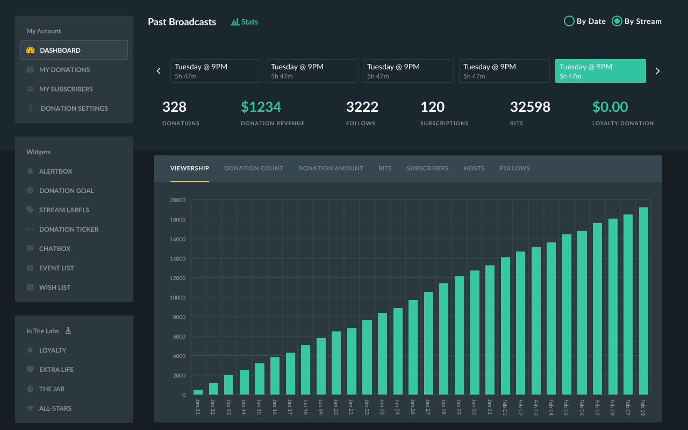
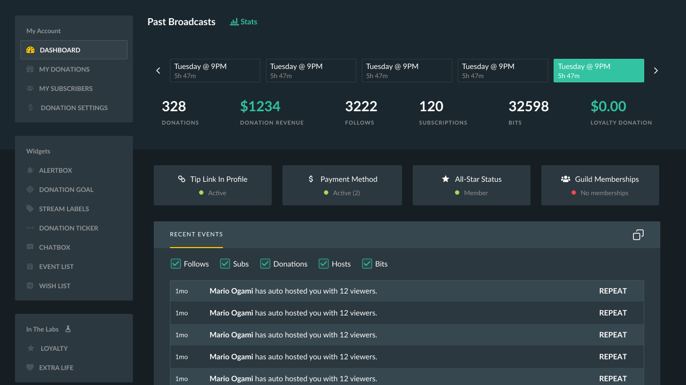

Once in a while I'd come across a screenshot of a cool UI that I think would be relatively simple to recreate in Figma, so I made it a personal challenge to do so. This is not something that I do in my spare time or anything because, quite frankly I don't have any spare time anymore. This is more of a distraction to prevent me from going insane between juggling 3 different major projects atm.

I will first start with 2 Streamlabs dashboard screens.

<!--more-->

 

You can get the file from my Freebies site [here](https://freebies.namvu.net/figma-freebie-streamlabs-dashboard/)
