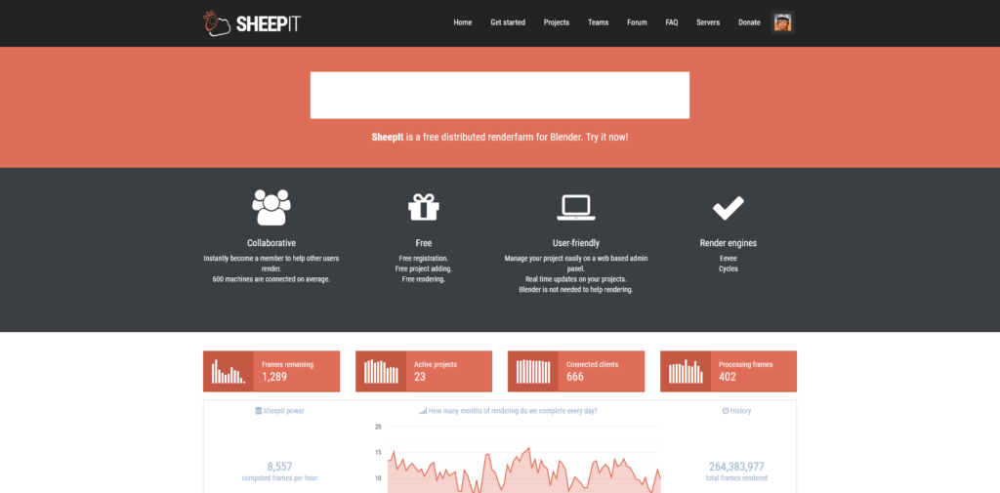

[](https://www.sheepit-renderfarm.com)

```
(this post will be written in Vietnamese as those are the main target audience)
```

[SheepIt](https://www.sheepit-renderfarm.com/home) là một dịch vụ render đám mây phân tán, miễn phí, giúp người dùng chia sẻ tài nguyên máy tính để tăng tốc quá trình render đồ họa 3D. Hệ thống hoạt động dựa trên sự đóng góp của cộng đồng, nơi mỗi người tham gia có thể sử dụng sức mạnh xử lý từ máy tính của mình để giúp render các dự án của người khác và ngược lại. Nhờ vào mô hình cộng đồng, SheepIt mang đến một giải pháp tiết kiệm chi phí, linh hoạt và hiệu quả cho các nghệ sĩ 3D, nhà làm phim và nhà thiết kế, hỗ trợ họ hoàn thành các tác phẩm một cách nhanh chóng và dễ dàng.

_**Full disclosure:** Mình là team founder của team [Vietnam](https://www.sheepit-renderfarm.com/team/1498) trên cộng đồng SheepIt. Nếu các bạn tham gia đóng góp computing power của máy mình trên SheepIt, các bạn có thể join vào team mình. Khi ở trong team các bạn sẽ được sử dụng điểm chung của team để render dự án của mình._ _Các bạn cũng có thể tham gia chém gió cùng các thành viên khác trong team Vietnam trên kênh Discord chính thức của team [tại đây](https://discord.gg/xsB6TdZB)._
