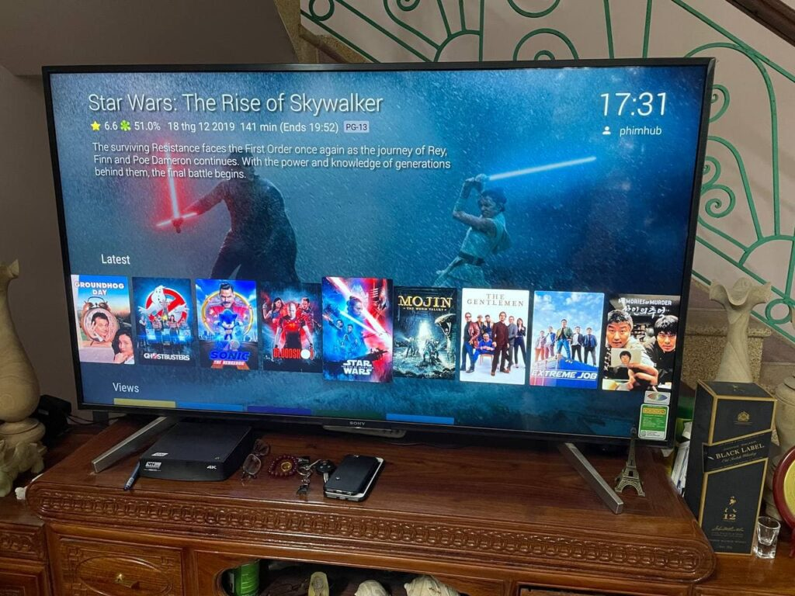

_(This is not really a guide or a tutorial, you may get some tips on how to setup a reverse proxy to access your server from your own domain, but if you're here looking for a full blown media server setup guide, you're in the wrong place)_

I'm sure I'm not the first to have setup a little media server at home serving all kinds of, um, totally legal content that you obtained from the Internet. But accessing it outside of your home has always been something that I never got around to do.

Until this Tet holiday that is.

Since I had to spend like 4-5 days at my inlaws during these times, I knew Netflix alone ain't gonna cut it, especially since I've pretty much watched everything that worth watching on it. I need to be able to access my quality contents that were sitting under my TV in my bedroom, a hundred kilometer away.

<figure>



<figcaption>

Jellyfin running perfectly on my inlaws' smart TV

</figcaption>

</figure>

Anywho, enough rambling. You want to know how I set it up. Read on.

<!--more-->

It's simple really, I bought a used Mac Mini 2011 for around $40 back in 2018. It has a what I believe a 3rd gen core i5 and 6GB of DDR3 SODIMM RAM. I know it is a potato, but it consumes about 85W at full load so I can leave it running 24/7 instead of my Ryzen rig. Originally it only serves as a media player for my wife to watch movies on FPT Play, HayHayTV, PubVN, MotPhim, etc. on our cheapo Asanzo TV (some of these services only run on a browser so Kodi doesn't cut it, need to be a fully functional OS). She only watches for around 2 hours each night, yet the thing is running 24/7, it would a complete waste of electricity if I don't somehow find a way to make it useful for the rest of the day.

And that's where Jellyfin came in. A few simple setups and you can now watch movies store on this little potato.

Basically there's only 4 steps involved:

1. Download, install and run Jellyfin server
2. Populate your media library with whatever movies/TV shows you have
3. Install Caddy and run the command below
4. Point your domain DNS to your home's public IP

I got the reverse proxy up, bind it to my domain WITH a valid SSL with a single command:

```shell
caddy reverse-proxy --from example.com --to 127.0.0.1:8096
```

(Check out [Jellyfin documentation on Caddy](https://jellyfin.org/docs/general/networking/caddy.html) if you need further information)

That's it. You're done!

Of course, since I'm running the server from my bedroom, there's still the issue with dynamic IP address. Viettel is not exactly the most reliable ISP so I get random modem reboot every couple of days. Everytime it happens I'd need to log into CloudFlare and manually change the DNS to my new public IP address. That is a pain indeed.

Luckily there is a way to automate this process.

## Running a cronjob to update your domain's DNS every hour.

You'll need a machine running 24/7 for this task. The most efficient way is to run it on your media server since it's already doing this.

But efficient is not what I do :P

I have an old Raspberry Pi (the original one) that is just begging to be useful. So that's what I'll use instead.

Basically, throw Raspbian on it, and setup a cronjob to run this shell script every few hours to update your DNS.

(The full guide can be found over at [LetsWP](https://letswp.io/cloudflare-as-dynamic-dns-raspberry-pi/), check them out, I only copy the script here for your convenience)

```shell
#!/bin/bash
# Cloudflare as Dynamic DNS
# From: https://letswp.io/cloudflare-as-dynamic-dns-raspberry-pi/
# Based on: https://gist.github.com/benkulbertis/fff10759c2391b6618dd/
# Original non-RPi article: https://phillymesh.net/2016/02/23/setting-up-dynamic-dns-for-your-registered-domain-through-cloudflare/

# Update these with real values
auth_email="email@example.com"
auth_key="global_api_key_goes_here" 
zone_name="example.com"
record_name="home.example.com"

# Don't touch these
ip=$(curl -s http://ipv4.icanhazip.com)
ip_file="ip.txt"
id_file="cloudflare.ids"
log_file="cloudflare.log"

# Keep files in the same folder when run from cron
current="$(pwd)"
cd "$(dirname "$(readlink -f "$0")")"

log() {
    if [ "$1" ]; then
        echo -e "[$(date)] - $1" >> $log_file
    fi
}

log "Check Initiated"

if [ -f $ip_file ]; then
    old_ip=$(cat $ip_file)
    if [ $ip == $old_ip ]; then
        log "IP has not changed."
        exit 0
    fi
fi

if [ -f $id_file ] && [ $(wc -l $id_file | cut -d " " -f 1) == 2 ]; then
    zone_identifier=$(head -1 $id_file)
    record_identifier=$(tail -1 $id_file)
else
    zone_identifier=$(curl -s -X GET "https://api.cloudflare.com/client/v4/zones?name=$zone_name" -H "X-Auth-Email: $auth_email" -H "X-Auth-Key: $auth_key" -H "Content-Type: application/json" | grep -Po '(?<="id":")[^"]*' | head -1 )
    record_identifier=$(curl -s -X GET "https://api.cloudflare.com/client/v4/zones/$zone_identifier/dns_records?name=$record_name" -H "X-Auth-Email: $auth_email" -H "X-Auth-Key: $auth_key" -H "Content-Type: application/json"  | grep -Po '(?<="id":")[^"]*')
    echo "$zone_identifier" > $id_file
    echo "$record_identifier" >> $id_file
fi

update=$(curl -s -X PUT "https://api.cloudflare.com/client/v4/zones/$zone_identifier/dns_records/$record_identifier" -H "X-Auth-Email: $auth_email" -H "X-Auth-Key: $auth_key" -H "Content-Type: application/json" --data "{\"id\":\"$zone_identifier\",\"type\":\"A\",\"name\":\"$record_name\",\"content\":\"$ip\"}")

if [[ $update == *"\"success\":false"* ]]; then
    message="API UPDATE FAILED. DUMPING RESULTS:\n$update"
    log "$message"
    echo -e "$message"
    exit 1 
else
    message="IP changed to: $ip"
    echo "$ip" > $ip_file
    log "$message"
    echo "$message"
fi

```

## FAQ

Why Jellyfin over Plex/Emby/<insert other media server name>?

I actually started with [Plex](https://www.plex.tv/), which seems to be the single most popular media server software these days. And it was great, unbelievably so for a free software. I was able to get my entire library up and running in no time, the UI looks slick (which for an interface designer like me, is a huge plus), and remote access works out of the box (provided of course, you have port forwarding properly setup on your router). But after using it for a couple of days, I decided to scrap it and go with Jellyfin, a lesser known media server solution. There's 2 things that bothered me with Plex:  
  
• **Plex is a lot less 'free' than you thought.** You may not need a Plex Pass to enable Remote Access on your own server, but can you really freely access it remotely is a huge asterisk. To clarify, accessing it remotely from the web client is entirely free with no restriction whatsoever. BUT accessing your Plex server from its mobile app is going to cost you, either in the form of the Plex Pass or in the case of the Android app, a one time payment of $5, which I paid, but still moved on anyway. Why? Because of the next point.  
  
• **Plex has started invading your personal library with their own contents.** While the contents they offer aren't exactly bad (I do love me some classic Popeye the Sailor Man), the way they populate their content in your own server makes it utterly confusing to end user to differentiate between Plex's content and your own. Most people who self-host stuffs tend to be pretty anal about having a setup exactly the way they want it, I'm no exception.  
  
As for Emby, I've heard good things about it, but I also heard it's more or less the same as Plex, right down to the premium pricing strategy, so I went ahead and skip it.  
  
Installed Jellyfin and was absolutely pleased with it, everything just works out of the box, and all the platform apps are free. As a strong supporter of the free software movement, it's a no brainer for me. Plex and Emby couldn't win me back even if they offer Plex Plass or Emby Premiere for free now.

Why use your own domain instead of a Dynamic DNS service like DynDNS or MyDNS.vn?

To be honest, for home use, there's no real good reason. In fact, if you're looking for simplicity, I'd recommend going that route. Most DDNS services can be configured right from your router, saving you the trouble of having a machine dedicated to updating the IP address, AND there's less setting up involved too (you don't even need a reverse proxy unless you want SSL).  
  
I only use my own domain because, well, I can. I have a bunch of domains lying around not being used for anything and and Raspberry Pi first gen that I don't know what to do with (its support had been dropped by virtually everyone). So naturally its only usefulness these days is being a DDNS server. Plus I managed to learn a couple of things along the way so...

Why run from your bedroom instead of deploying on a GCP/AWS instance or a web server like you usually do?

I actually did for a while, but as it turns out, big corps hate anything to with movies sharing on the interweb. I initially hosted a wordpress site on the same server as namvu.net (which doesn't even host any of the movies), and Google illegally suspended my VM instance without even a warning, took out namvu.net and a bunch of my other websites as well. To add insults to injury, they even had the galls to ask me why THEY suspended ME (!?). Talking about incompetency

Do I really need a reverse proxy to access Jellyfin remotely?

As a matter of fact, you don't. The only thing the reverse proxy is good for in this use case is so you can easily bind your domain to the exact address + port combination on your server, and add a SSL to it so users don't have to remember the port number everytime they need to access your library. So instead of going to _172.191.1.255:8096_ and be greeted with a big fat warning about unsecure connection (if they are using a modern browser), your users can just visit yoursite.domain and boom, they're in business, much like going to Netflix.  
You could potentially get around the port issue by somehow running on Jellyfin on port 80 (default http port) or something. But on UNIX systems like Linux and OS X you need elevated access to run services on port below 1024, which means you have to manually start the service each time your machine start. I didn't want to bother with that.

Why caddy over nginx for reverse proxy? I heard so much about nginx but never heard about caddy

So did I, that's why I actually started with nginx. But setting nginx up is a daunting task in itself. My Mac Mini is 2011 which means it's stuck with High Sierra, meaning almost all Homebrew package now needs to be built from source. That's easy enough but there's still the issue with setting nginx up and running on restricted port which I mentioned above. You need nginx on port 80 if you want to use any AutoSSL script like acme.sh or certbot. That involves editing some config file and I absolutely detest nginx config format.  
Caddy on the other hand, well it just works. One single command and it gets your reverse proxy up, bind your domain to your port, AND auto secure it with a SSL. With One - Single - Command - Line.  
There's really no contest here.
