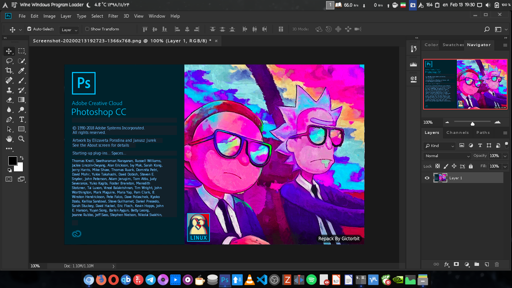

No, this is not GIMPShop or any other dirty hacks that attempt to make GIMP/Krita look or feel like Photoshop. This is the real Photoshop. And no, Adobe hasn't changed their mind about making a native Linux version available either. As you may have guessed, despite the fancy new splash screen, this is just Photoshop CC running on Wine, but it has been repacked so the installer does everything for you. If you already have a PS + Wine in place there's no need to read this.

Bits of warning though, I'm not entirely sure this is legal since the authentication part appears to be bypassed also. While I do have an active subscription to Adobe CC, I haven't been able to find a way to sign in with this. If this repo gets popular Adobe might kill it, so just keep that in mind.

Anyway, you can find the instruction here in [this Github](https://github.com/Gictorbit/photoshopCClinux), I'm not going to mirror the instruction in this blog post (unless the repo goes down for some reason, in which case, let me know in a comment below)
