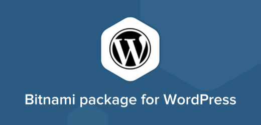

I absolutely love [Bitnami](https://bitnami.com/) due to its sheer simplicity in making the process of setting up a local web stack a complete breeze, especially how adding modules like Wordpress, Drupal, Magento etc. is as easy as installing Skype. There's one thing that bothers me with the module installers though, is that there's no multi installation option available during the installation process. Well after a bit of digging around, I realize that the option is there, but for some reason it's not baked into the GUI installer. Instead you'd need to pass the option using the command line interface. That's not a problem for me but many people who's not familiar with the CLI may find it a hassle, which it is. But once you get the hang of it, it's actually the easiest way to add additional installation of a webapp to your development stack (yes, even easier than doing it manually since you don't have to go through the database creation process).

To install the Wordpress module into an alternative location, you need to use the switch _\--wordpress\_instance\_name NEW\_BLOG_ where NEW\_BLOG is the directory you want to install your copy of WP in.

Specifically, here's the instruction for each platform:

### Windows

```
shell> ./bitnami-wordpress-VERSION-module-windows-installer.exe --wordpress_instance_name NEW_BLOG_NAME
```

### Linux

Only use _sudo_ if the stack was installed as _root_.

```
sudo chmod a+x bitnami-wordpress-VERSION-module-linux-x64-installer.run
sudo ./bitnami-wordpress-VERSION-module-linux-x64-installer.run --wordpress_instance_name NEW_BLOG_NAME
```

### Mac OS X

```
hdiutil mount bitnami-wordpress-VERSION-module-osx-x86_64-installer.dmg
/Volumes/WordPress\ Module\ VERSION/BitNami\ WordPress\ Module.app/Contents/MacOS/installbuilder.sh --wordpress_instance_name NEW_BLOG_NAME
```

Once you have the module installed, you will be able to access it through _http://localhost/NEW\_BLOG\_NAME_

(if you launch it using the launcher, it will still go to the default address _http://localhost/wordpress,_ you will need to enter the address manually in the URL bar).

Bitnami is a great product and hopefully the company will have enough money to afford a read developer who could put this simple option in the GUI installer soon.
