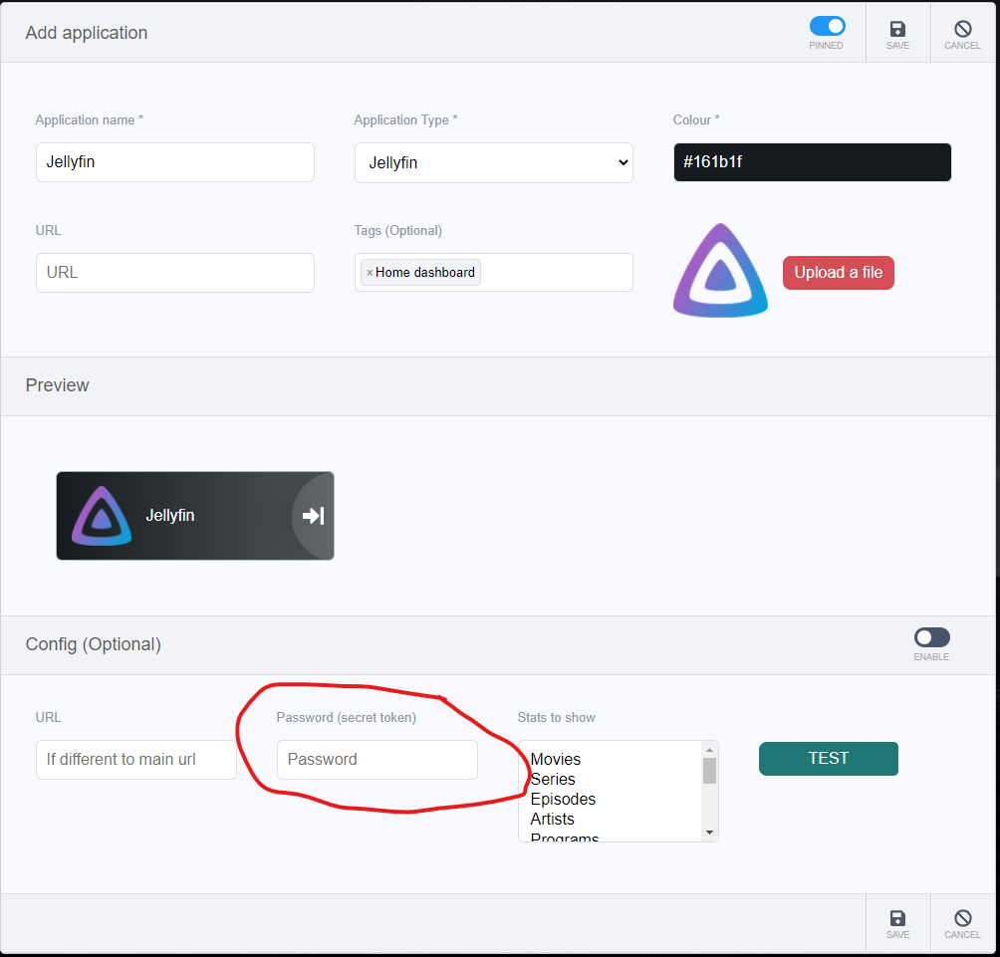
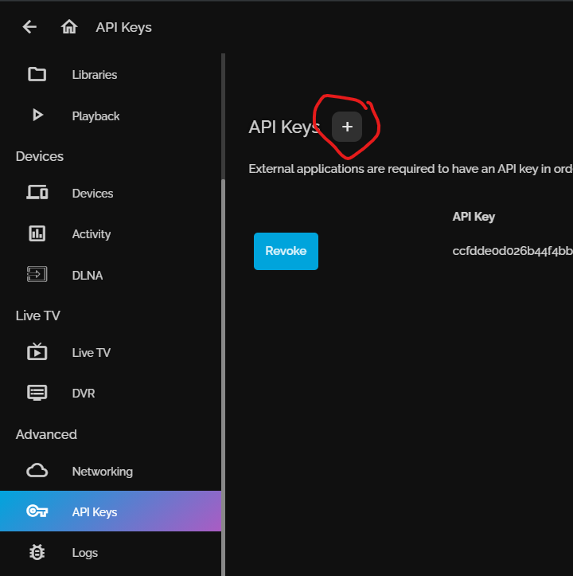
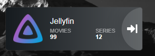

So you're probably in the process of integrating [Jellyfin](https://jellyfin.org/) with [Heimdall](https://heimdall.site/), and you're stumped by this little field in the Add application screen in Heimdall:

Just what the heck are we supposed to put in there? Neither the username nor password of my Jellyfin account works here, just what the heck is this 'Password (Secret token)' thing that Heimdall is asking for?

The more tech savvy among you probably have already figured it out, but if you're an idiot like me, you're gonna waste a few rage inducing hours searching for it on the Internet to no avail, nobody on the Interweb seems to know what it is. Well I figured it out, and I'm gonna tell you.

<!--more-->

It's the friggin' **API KEY**!

Yep, I don't know who's responsible for the wording in Heimdall but if I know he's definitely not getting invited to my birthday party.

If you want the user to input the API Key, just say API Key.

Not 'Password'

Not 'Secret Token'

**API Fucking Key!**

To make matter worse, there's no guide or even a simple reddit post that point you to where you can obtain such key. Lucky for you, I went through that for you.

In Jellyfin just go to **Dashboard > Advanced > API Keys**, click on the little **(+)** icon, put whatever name you want (mine just says Heimdall) and there you have it.

Copy that key and paste that into Heimdall's Add Application screen, right into that so called 'Password' field, along with other information and it should now work.

_Bonus tip: for the 'Stats to show' option, you can select multiple stats by holding down the Shift key._
