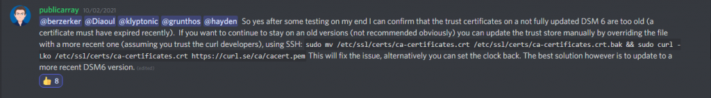
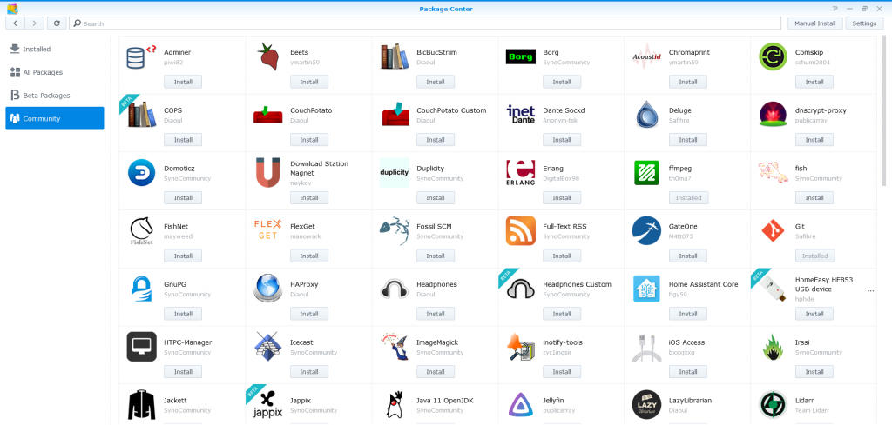

I presume you're here from Google, trying to find a solution on why Synology DSM is not accepting [SynoCommunity](https://synocommunity.com/)'s repo, returning a cryptic "**Invalid Location**" error. You're probably running DSM 6.2.4 or older, and currently unable to upgrade to DSM due to uh, various considerations (\*cough\*xpenology\*cough\*).

Turns out it's a SSL error, not sure if it's related to Let's Encrypt's root certificate [expiring a few weeks ago](https://techcrunch.com/2021/09/21/lets-encrypt-root-expiry/) knocking out a sizable chunk of the web, but thanks to @publicarray over on SynoCommunity's Discord, we have a solution

<figure>



<figcaption>

Publicarray's solution from Discord

</figcaption>

</figure>

Here's the SSH command for your convenience:

<!--more-->

```
sudo mv /etc/ssl/certs/ca-certificates.crt /etc/ssl/certs/ca-certificates.crt.bak && sudo curl -Lko /etc/ssl/certs/ca-certificates.crt https://curl.se/ca/cacert.pem
```

Obviously if you don't have SSH access, you could always turn back the clock as he suggested. Either way it works!

<figure>



<figcaption>

SynoCommunity Packages

</figcaption>

</figure>

**Update Oct 22, 2021**:

I've recently received a great tip from Freeman from [Jotographer](https://jotographer.com/) for executing the script without SSH access and NOT having to turn back the clock, here's an excerpt from his email:

> Simply "**Create" > "Scheduled Task**" > "**User-defined script**". In the "**General**" tab, it doesn't matter if the task is enable or not, but make sure the user is root. Then in the "**Task Settings**" tab, paste the script into the "**User-defined script**" field w/o sudo. Then click "**OK**" button to finish creating the task. Right click on the newly created task and select "**Run**". After that the task can now be deleted.
> 
> freeman@jotographer.com

Thanks Freeman, and I apologize for the broken comment system on my site, I'm still working on it :D.
