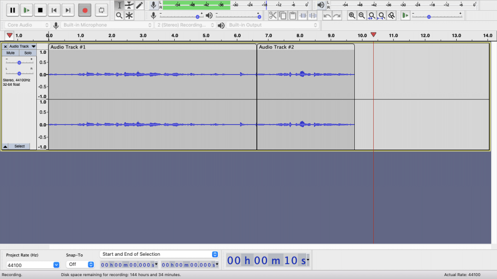
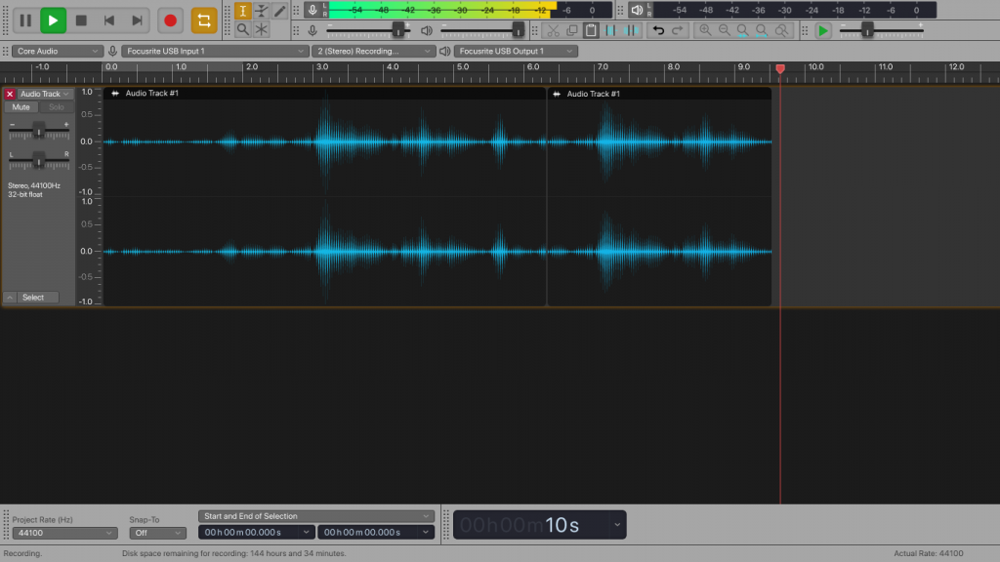

If you recall I actually [attempted to touch on this subject once in the past](https://namvu.net/portfolio/audacity-interface-redesign-2/). That was back when I still used Photoshop for UI design, so that little screenshot took me like 3 days or something. Today I'm attempting to do it again but in Figma and see if I could do something similar in 3 hours.

What if Audacity has a theme that used the same design language as Apple's Logic Pro X?

