It is no secret that I am a [major self-hosting fanatic](https://namvu.net/2021/12/guess-which-hobby-i-picked-up-in-2021/), but people have been asking specifically about what it is that I host my home "server" (which is a glorified term really, it's only an old Pavillion laptop running a 4th gen core i5 and 8GB of DDR3 memory). Still

## 1\. [Authelia](https://www.authelia.com/) (Authentication and Authorization gateway)

<figure>

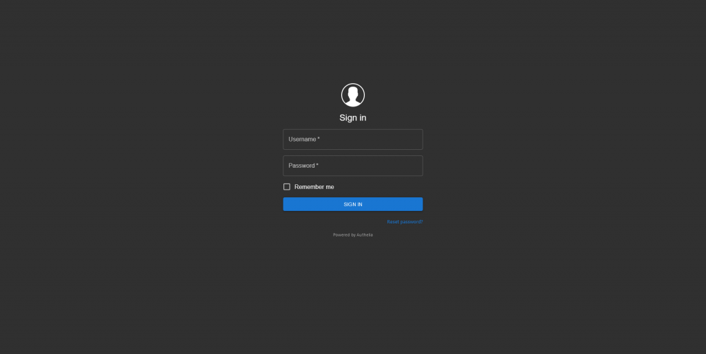

<figcaption>

There's not much to Authelia's interface except for the login screen.

</figcaption>

</figure>

Authelia is an authentication gateway. You only need to sign in once and you'll get access to the whole server, but it's not really SSO. You still need separate accounts for their respective applications. Still, having an additional layer of security in front of your services does provide peace of mind, especially when you combine it with Duo Security as a MFA method.

## 2\. [NGINX Proxy Manager](https://nginxproxymanager.com/) (Reverse proxy)

<figure>

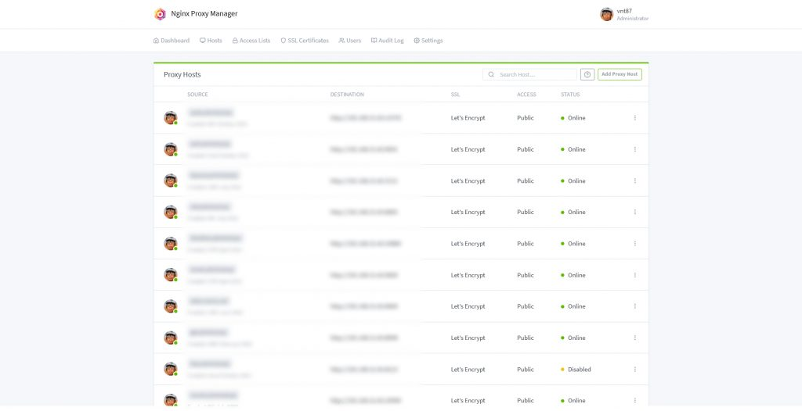

<figcaption>

NPM is my reverse proxy of choice, and is central to my whole setup.

</figcaption>

</figure>

There's many reverse proxies out there, like Traefik and Caddy, which is actually what I started it. But I choose NPM due to its simplicity. Sure Traefik and Caddy may offer more fine tune controls and is more suitable for power users, but NPM just works™ with minimal configuration. It also handles SSL (via Let's Encrypt) and its default configuration covers most of my need.

## 3\. [Jellyfin](https://jellyfin.org/) (Media Server)

<figure>

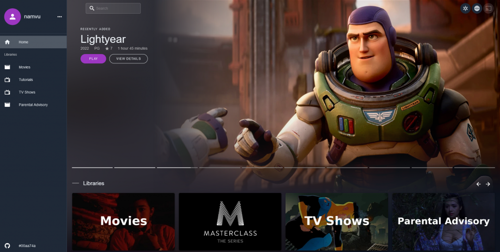

<figcaption>

Among all the services that I selfhost, Jellyfin is by far the most frequently used. (Pictured here is the [VueJS frontend](https://jf-vue.pages.dev))

</figcaption>

</figure>

This is it, this is what sent me down this self-hosting rabbit hole. Those who followed me would remember that I run a small movie club called Phimhub, and I started out with a Wordpress website much like namvu.net, that listed (NOT hosted) a number of interesting movie titles for our group. Much to our dismay Google, in their infinite wisdom, decided they didn't like the site and axed my account (no specific reason given). So I did what any reasonable person would do, and host my own media server, with blackjack and hookers.

<!--more-->

I initially made the foolish mistake of choosing Plex, even went as far as purchasing a Plex pass for Android, before realizing I'm effectively running an ads platform WHILE paying them to shove ads into my face. The transition to Jellyfin was quick and painless. It's perfect by any mean, as there's a lot of technical debt leftover from the Emby codebase that people are working hard to work around, but it's definitely the best among the current available media servers.

## 4\. [Xpenology](http://Lamborghini và Ferrari) + Synology Disk Station Manager

<figure>

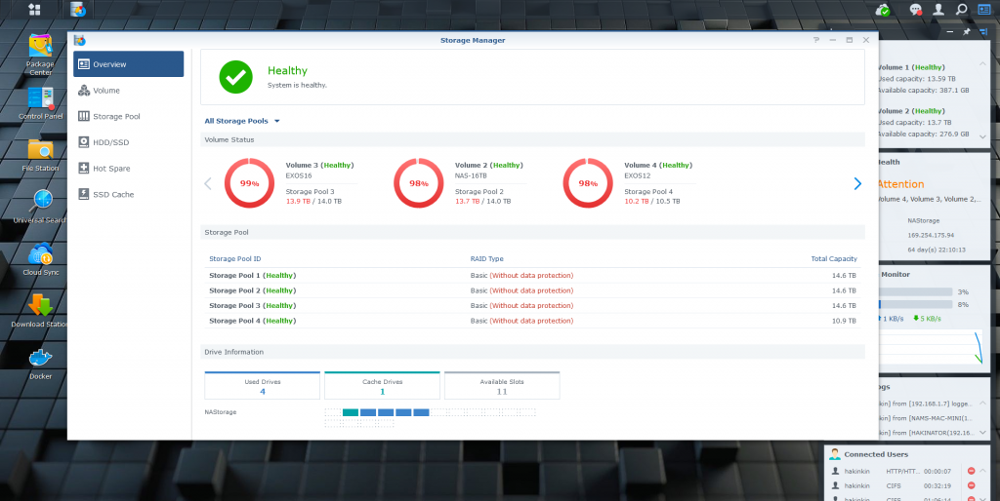

<figcaption>

Xpenology bootloader allows you to run Synology's excellent DSM as a drop in for a in-browser OS.

</figcaption>

</figure>

DSM gives you a file manager, a Docker manager (although far inferior to Portainer), a Download manager (with torrent support), photo viewer, camera monitor, system monitor and analysis tools, and tons of other addons. You could even deploy a full LAMP stack, or a Tailscale node. It's the main reason why I don't have Nextcloud installed on my server even though it's massively popular among selfhosters. It's the only one in this list that isn't free and opensource, and the legalities around the bootloader is questionable, but I can't give two shits about that, I just use whatever work best.

## 5\. [Portainer](https://www.portainer.io/) (Docker manager)

<figure>

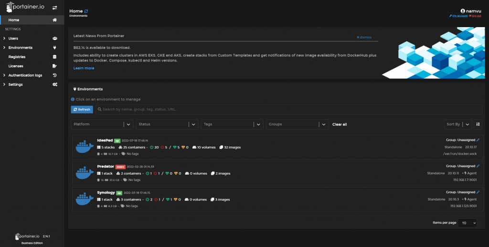

<figcaption>

Portainer Business Edition 2.14.1 with Dark Mode enabled

</figcaption>

</figure>

Almost everything I run is containerized with Docker, and with over 30 containers running on 3 different machines, it's nice to have a GUI to manage them from a single place. I choose Portainer due to its ease of use, and better UI than [Yacht](https://yacht.sh/). For personal use I recommend deploying the Business Edition since it's free for 5 users for less. Honestly I don't notice any difference between it and the Community edition, but they splatters the Community version with ads for the BE so I just went with it.

## 6\. [NetData](https://www.netdata.cloud/) (System monitoring)

<figure>

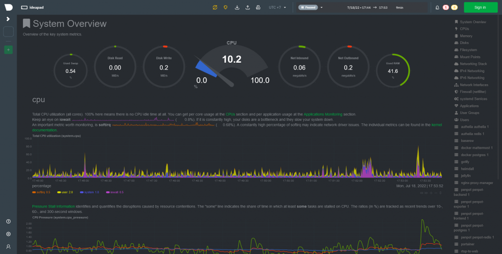

<figcaption>

NetData gorgeous interface

</figcaption>

</figure>

When it comes to server monitoring, many people opt for options like Grafana, which admittedly looks amazing if you spend enough time playing with it. For people that just want something that works™, NetData is an awesome tool. A single install command one-liner and you're good to go.

```bash
wget -O /tmp/netdata-kickstart.sh https://my-netdata.io/kickstart.sh && sh /tmp/netdata-kickstart.sh
```

In reality though, I find myself using btop over SSH a lot more than netadata, but I do like having something that doesn't require a client, which brings us to the next one.

## 7\. [Apache Guacamole™](https://guacamole.apache.org/) (Clientless desktop gateway)

<figure>

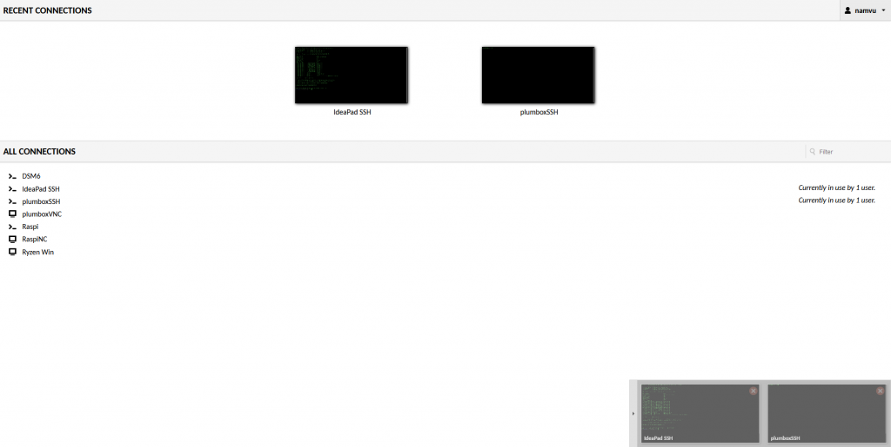

<figcaption>

Main Guacamole window

</figcaption>

</figure>

Guacamole allows you to open a SSH or VNC or even RDP session to any computer on the network right from the browser (ie. clientless, as you don't need a SSH or VNC client to use it, just a browser). Needless to say this is something that I imagine most sefl-hosters would not need, or even wanted in their service stack

## 8\. [Uptime Kuma](https://github.com/louislam/uptime-kuma) (Uptime monitor)

<figure>

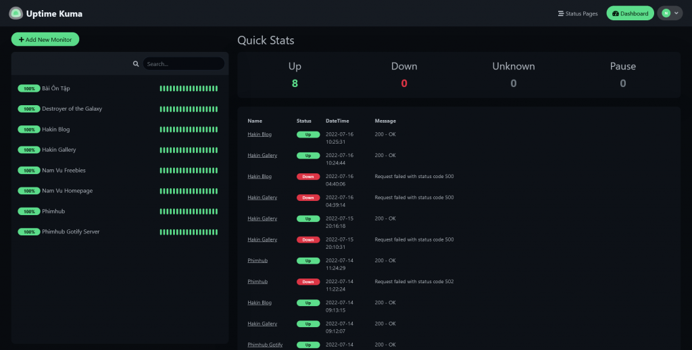

<figcaption>

Uptime Kuma screenshot

</figcaption>

</figure>

I have 5 websites on my Linode VPS, plus over 2 dozens other services that I selfhost on various place. Needless to say I'm not able to check all of them on a daily basis. Luckily there's a tool that does that for me. This pairs very nicely with #17 (gotify) for mobile push notifications. Even without Gotify, you can already push your notifications to dozens of service like Telegram, Mattermost, Whatsapp etc.

## 9\. [RTSPtoWEB](https://github.com/deepch/RTSPtoWeb) (CCTV Camera Viewer)

<figure>

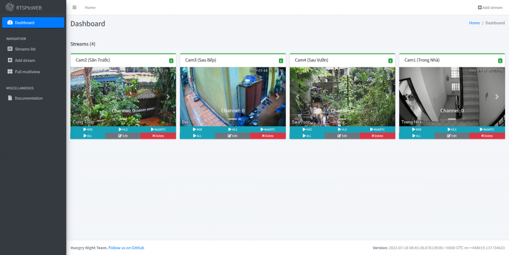

<figcaption>

Security Camera Viewer

</figcaption>

</figure>

So my cheapo Chinese analog CCTV system relies on Internet Fucking Explorer to operate, and to add insult to injury it requires an old NPAPI plugin to boot. With Windows trying hard to kill off IE, I have to find a different solution to view my camera feed. RTSPtoWeb is the perfect solution for this, not to mention it integrates well with #13 Home Assistant

## 10\. [Mattermost](https://mattermost.com/) (Team chat)

<figure>

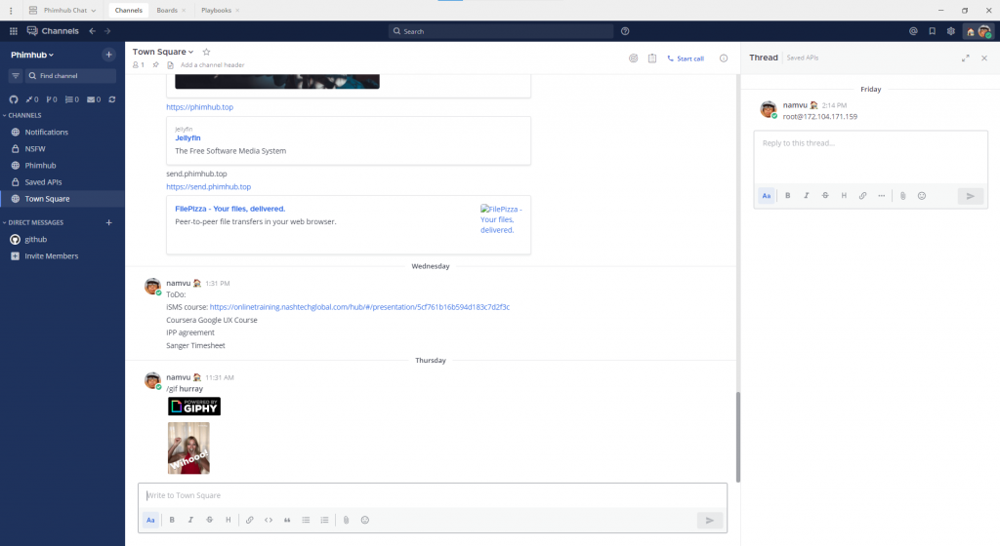

<figcaption>

Mattermost Team edition 7.1.2-rc1

</figcaption>

</figure>

## 11\. [Penpot](https://penpot.app/) (UI Design tool)

<figure>

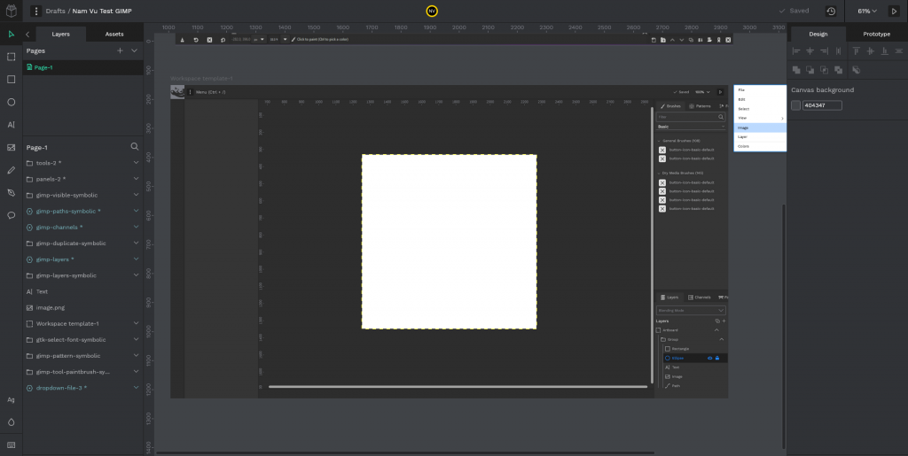

<figcaption>

Penpot gorgeous UI (Yes, I'm redesigning GIMP's interface, again)

</figcaption>

</figure>

Y'all know I design user interfaces for a living, and thus my life depends on Figma. Now I don't have a problem with Figma at all, including both the way the app work and the way their business operate. But as a self-hoster, I've always wanted

## 12\. [Heimdall](https://heimdall.site/) (Application dashboard)

<figure>

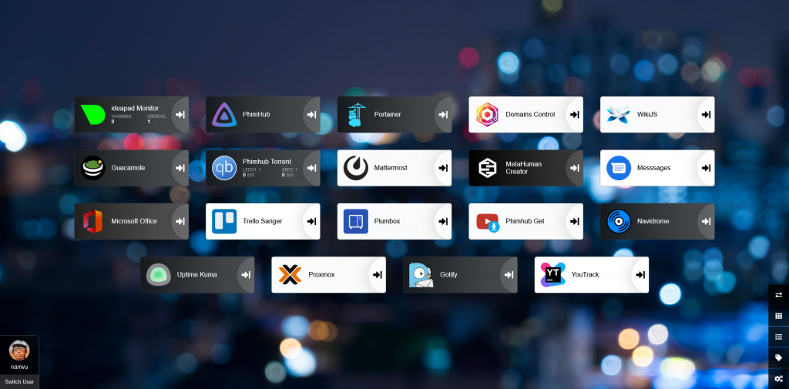

<figcaption>

My Heimdall dashboard

</figcaption>

</figure>

App dashboards are a dime a dozen among self-hoster, mainly due to how easy it is to setup. There's literally dozens of apps in this category: Heimdall, Homer, Dashy, Flame just to name a few. But not all of them are configurable from the frontend. Some of them requires you to fuck around with either a YAML file or something else. I just go with the least complicated one, Heimdall, which allows you to add apps from the front end and even pull some data from the ingrated app.

## 13\. [HomeAssistant](https://www.home-assistant.io/) (Smart home & automation)

<figure>

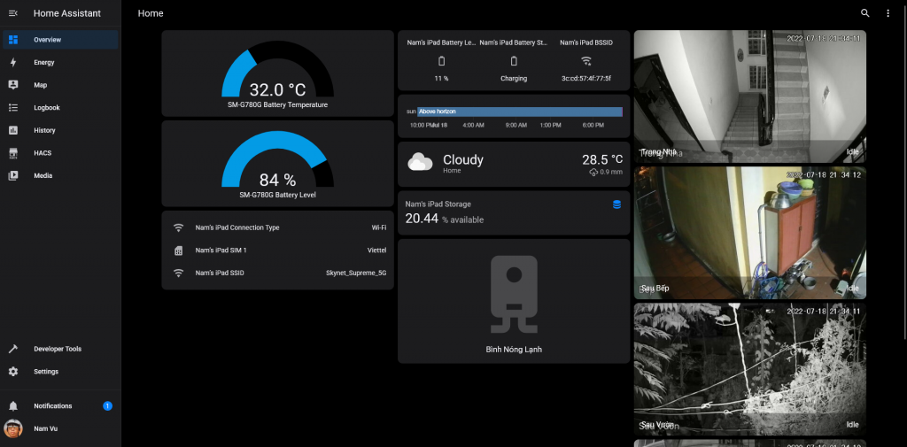

<figcaption>

Hass home dashboard with iOS theme (dark)

</figcaption>

</figure>

The only reason this is this far down the list is not because it's not good, but because it's so good that I still haven't been able to work out the best workflow for it yet

## 14\. [Navidrome](https://www.navidrome.org/) (HQ music streaming server)

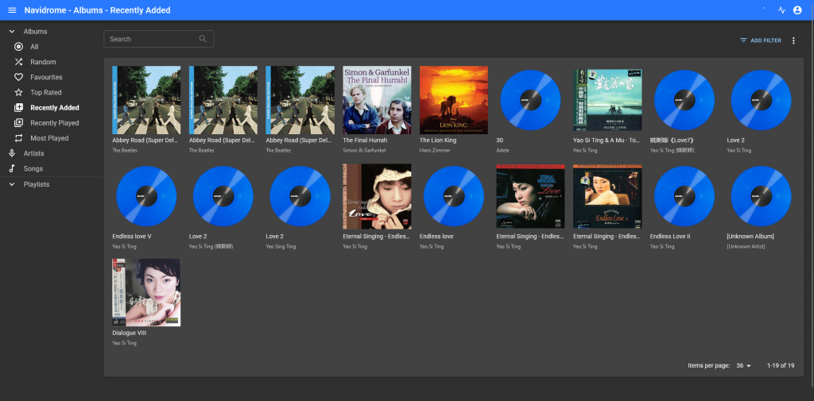

## 15\. [YoutubeDL](https://github.com/Tzahi12345/YoutubeDL-Material) Material

<figure>

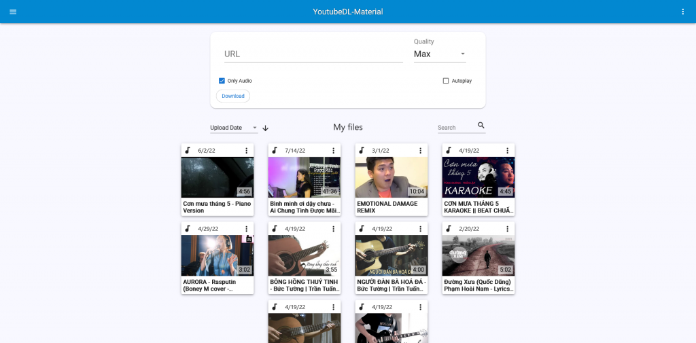

<figcaption>

YoutubeDL-Material screenshot

</figcaption>

</figure>

## 16\. [Send](https://github.com/timvisee/send) (File transfer)

<figure>

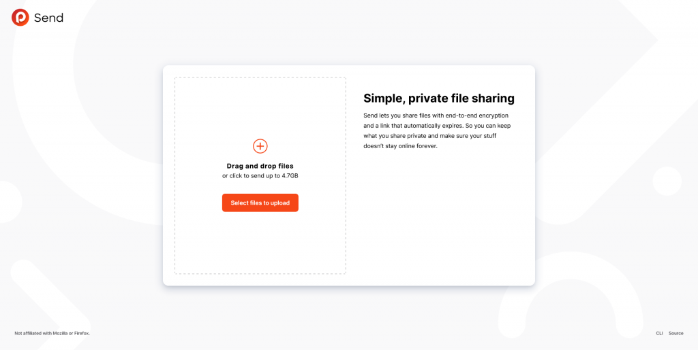

<figcaption>

The all familiar Firefox Send interface. You'll notice that its interface is significantly more slick than other apps in this list, clearly a UI designer was presented in the making of this app.

</figcaption>

</figure>

A fork of Firefox Send, which was [officially retired](https://support.mozilla.org/en-US/kb/what-happened-firefox-send) by the Mozilla foundation. I wanted something super simple

#### Alternative choice:

[FilePizza](https://file.pizza) excellent p2p file sharing tool, very simple to setup, however the lack of custom styling turned me to Firefox Send

## 17\. [Gotify](https://gotify.net/) (Push notification)

<figure>

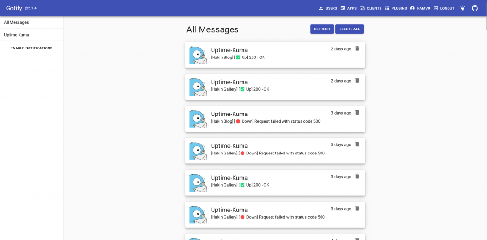

<figcaption>

Gotify very primitive interface

</figcaption>

</figure>

Excellent tool for delivering notifications to your mobile device. Pair very nicely with #8 (Uptime Kuma)
