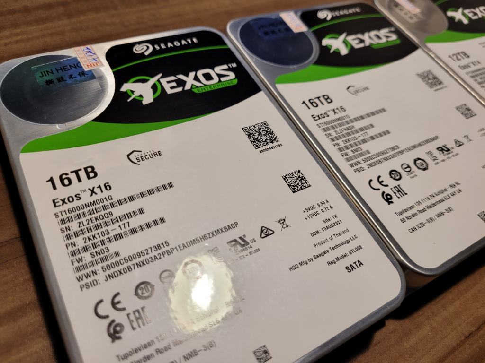

As you may know, I run a little [movie club](https://www.facebook.com/groups/phimhub), which started out as a Netflix group buy a year ago, which later led to me [setting up my own Netflix](https://namvu.net/2021/02/hosting-my-own-netflix-on-an-ancient-mac-mini-2011/) (with Jellyfin) eventually leading to me going down the [/r/selfhosted](https://www.reddit.com/r/selfhosted/) rabbit hole, learning a ton of stuffs about personal server deployment along the way.

It served us well, albeit with some annoyances. For starter, it only runs from 8am to 11.30pm everyday, mainly because I hosted it from my personal desktop, which is only powered on during those period. Another drawback of running it from my personal PC is the lack of space. I only had a single 3TB HDD installed, and Phimhub's library had long exceeded that. I tried to work around it by using Google Drive File Stream (now simply known as Google Drive) to keep only a fraction of the files offline, and leave the rest on the cloud. This effectively means that only around 30% of Phimhub's library was ready to play at any time.

<figure>

<figcaption>

So much room for activities!

</figcaption>

</figure>

Well, today I'm proud to say those annoyances should be gone. I've finished building a DIY NAS running Xpenology with a whopping 64TB of storage (2x WD Ultrastar 16Tb, 2x Seagate Exos 16Tb, all enterprise class, datacenter ready drives). I've also procured a more powerful laptop to act as the resident server, hosting every single services in one place (containerized of course). A bump from N3060 to an i5-4200M means now I can move Jellyfin to the laptop itself instead of running it from my PC. While the i5 does consume quite a bit more power than the Celeron (37w vs 6w), but it's still better than running my power hungry desktop PC for 16 hours a day for sure.

Essentially, instead of hosting Jellyfin AND the media library on my own PC, now Jellyfin will be moved into a docker container on my laptop server, and the media library will reside on the family NAS. You do need to mount the SMB share as a local mount on your server of course. One drawback of this approach is that you can no longer delete media from the Web UI, since I didn't give the docker container write permission to the SMB share. I could do that but I figure it's better this way, since I'll be the only one managing the media files anyway, I can just do it from my local computer.
