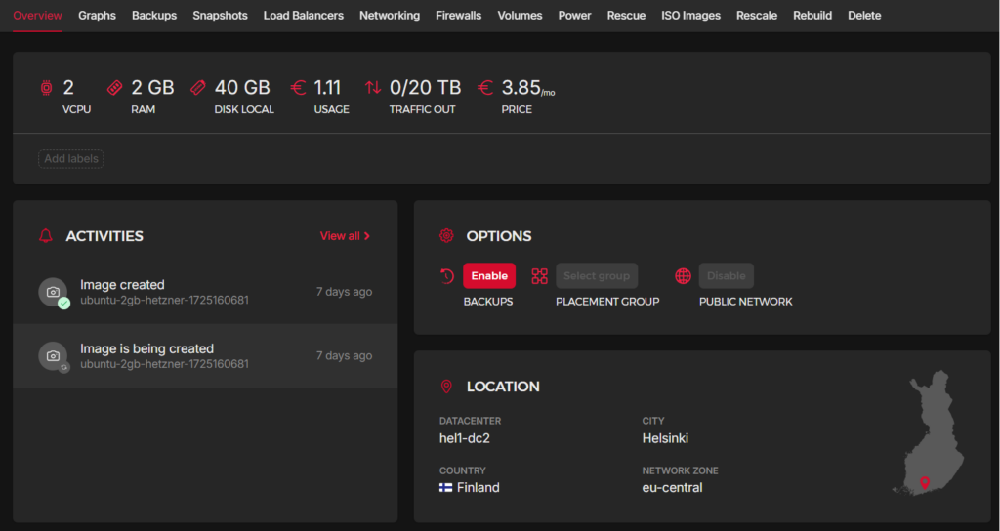

So I've switched to yet another cloud provider. This time it's Hetzner.

While I prefer to self-host most of the services that I use (media server, team chat, password manager, CCTV etc.), I still keep my Wordpress sites on a separate VPS. The main reason why I do this is because I prefer to keep all my self-host services containerized in docker, but the LAMP stack is one of the few things that runs just so much better bare-metal than containerized. You don't have to worry about volume bindings, multiple db container vs single db container, PHP settings etc. Plus it never hurts to have a VPS laying around in case you need a sock proxy.

My VPS history:

Started with Google Cloud Platform, it served me well and taught me a lot about managing VPS. Performance was top-notch (it's still Google after all). Google later revised their pricing which put it outside of my price range. I then looked into Oracle Cloud since I heard a lot of good things about their free tier VPS. Unfortunately though its performance was horrible for me. I couldn't get any of the fabled ARM VPS with 24GB RAM that they offer, but for me I would be fine even with the micro 1 vCPU 1GB RAM instance, IF it worked. Unfortunately it was unreachable most of the time (I registered for the South Korean datacenter, it was before the Singapore DC was available). So I started looking else where, finally decided to settle with Linode's nanode.

It worked, for a while. Until performance became a problem again. With the $5 nanode (1 vCPU, 1GB RAM) I was constantly getting database timeout errors. It was clear 1GB just wasn't cutting it. Unfortunately adding just 1GB more RAM would've doubled the monthly fee to $11. I was unhappy with that value.

So anyway, long story short, I switched to Hetzner as per many recommendations on reddit. And you know what, redditors know their stuffs. For less than the price of a Vietnamese Starbucks I'm getting 2 vCPU, 2GB RAM, 40GB Storage and 20Tb bandwidth per month. This beats the absolute living shit out of any offer from Vulture, Linode, DigitalOcean, OVH etc.

The downside is of course, this pricing only applies to VM instances located in Europe. I suppose Hetzner has some sort of home turf advantage that enabled them to keep the cost down. They recently introduced a new data center in Singapore. I tried provisioning a VM there but the monthly cost is more than triple the price of Helsinki. But I can live with a little of latency if that means I can keep the cost at a reasonable level. Otherwise I'd just bring everything back to run on my home NAS.
