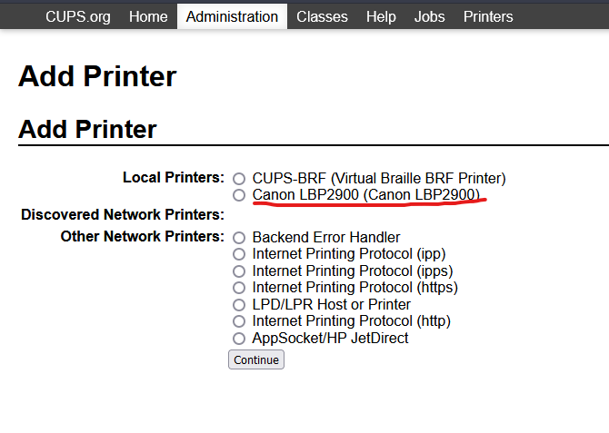
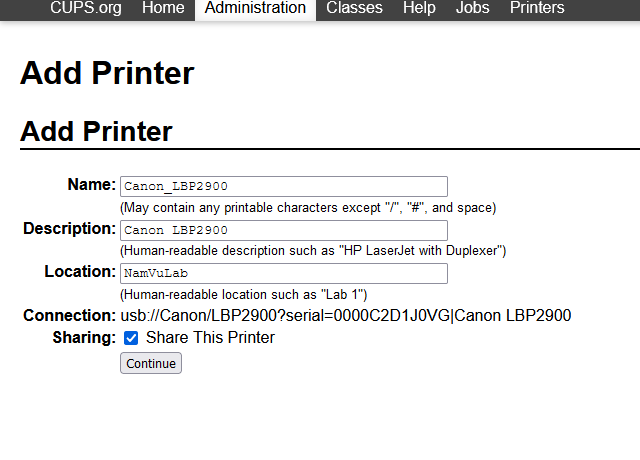
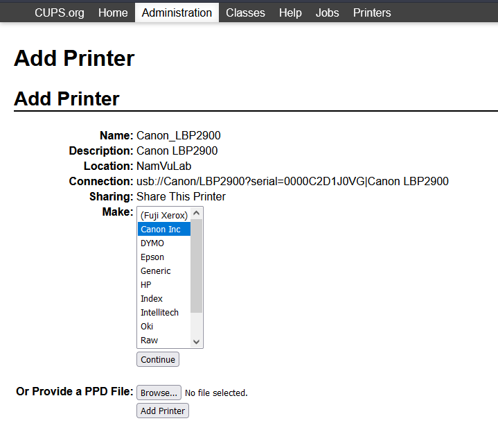
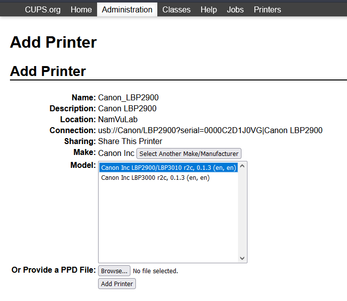
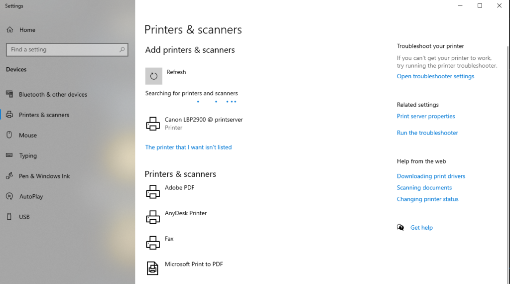

Ok so after using it as an Media Server (OSMC, Kodi), Audio Server (Volumio, Moode), and most recently a CloudFlare DDNS updater on top of Raspbian Lite, I'm running out of things to do with my old RPi. I figure there's one thing I haven't tried turning it into: a print server. So that's what we're gonna do today.

Now this is actually one of the most common usage of the Pi so there's already plenty of guides out there, and there's really no information in this post that can't be found elsewhere on the Internet, but I'm gonna do a write up anyway, purely for the sake of documenting my process.

For the software we'll be using CUPS running on top of Linux, naturally, since we don't have a lot of options on that front. For the hardware, we'll be using a first gen Raspberry Pi for the print server part, and Canon LBP 2900 for the actual printing.

Now this printer is interesting really, because despite being one of the most popular printers here in Vietnam, it's not in the list of printer supported by CUPS. I reckon its popularity is fueled by its economical nature, it's one of the very few laser printers that fall into the 'cheap to buy, cheap to maintain' segment (it costs like $150 brand new, and cartridge replacement is like $3.85, which is insane!). So getting it to work with CUPS is going to require a bit more works, but thankfully there's an open source driver out there that somebody reverse engineered to our benefits, so we'll be using that.

<!--more-->

Ok first you need a RPi running a Linux flavor of your choice, I'm running Ubuntu Server 20.04 for ARM, you can also use Raspbian (use the Lite version if you plan to go headless) or DietPi. I actually tried DietPi first but current internet situation prevents it from reaching the update servers, plus I don't like how it forces you to install a desktop environment on first install.

Once you have everything up and running, start by installing CUPS and the rest of the perquisites:

```
sudo apt install -y build-essential git autoconf libtool cups libcups2-dev libcupsimage2-dev
```

Grab the source code:

```
git clone https://github.com/agalakhov/captdriver.git
```

Compile the driver

```
cd captdriver
autoreconf -i
./configure
make
```

Copy the files to their relevant locations

```
sudo cp src/rastertocapt /usr/lib/cups/filter/
sudo cp Canon*.ppd /usr/share/ppd/custom/
```

Now go to CUPS WebUI (_https://<raspberry-pi-ip>:631_) (if you can't access it, see the UPDATE below), go to the **Administration** tab and click on 'Add Printer'

<figure>



<figcaption>

If you have the printer plugged into your RPi then it should show up under 'Local Printers'

</figcaption>

</figure>

<figure>



<figcaption>

Give it an easy to remember name, and remember to check 'Share This Printer'

</figcaption>

</figure>

<figure>



<figcaption>

Select 'Canon Inc' here, if you don't see it, refer to the ' Copy the files to their relevant locations' section above

</figcaption>

</figure>

<figure>



<figcaption>

Select your printer model and you should be good to go

</figcaption>

</figure>

If everything went correctly, your printer should now be detectable by other computers on the same network. For example, on my Windows PC next room, I could just go to Add a new printer and here it is:



Go ahead, add it and print a test page, see if it works.

**UPDATE July 30:** As I was going over this process for a second time, I realize I missed one step: that is setting CUPS up to be remotely accessible. CUPS default configuration only let you access the WebUI from the local machine, which is really dumb IMO, but not a lot of old opensource project can say they put the end user front and center in their design process. Anyway, the point is, if you want to access CUPS WebUI from another machine, you need to edit /etc/cups/cupsd.conf and modify a few values. Specifically:

Find `# Only listen for connections from the local machine.`

Replace `listen localhost:631` with just `Port 631`

Find `# Show shared printers on the local network.`

Change `Browsing Off` to `Browsing On`

Find `# Restrict access to the server…` and `# Restrict access to the admin pages…`

Add `Allow all` above `Order allow,deny`

I've included the entirety of my cupsd.conf here if you need it:

```
#
# Configuration file for the CUPS scheduler.  See "man cupsd.conf" for a
# complete description of this file.
#

# Log general information in error_log - change "warn" to "debug"
# for troubleshooting...
LogLevel warn
PageLogFormat

# Deactivate CUPS' internal logrotating, as we provide a better one, especially
# LogLevel debug2 gets usable now
MaxLogSize 0

# Only listen for connections from the local machine.
Port 631
Listen /run/cups/cups.sock

# Show shared printers on the local network.
Browsing On
BrowseLocalProtocols dnssd

# Default authentication type, when authentication is required...
DefaultAuthType Basic

# Web interface setting...
WebInterface Yes

# Restrict access to the server...
<Location />
  Allow all
  Order allow,deny
</Location>

# Restrict access to the admin pages...
<Location /admin>
  Allow all
  Order allow,deny
</Location>

# Restrict access to configuration files...
<Location /admin/conf>
  AuthType Default
  Require user @SYSTEM
  Order allow,deny
</Location>

# Restrict access to log files...
<Location /admin/log>
  AuthType Default
  Require user @SYSTEM
  Order allow,deny
</Location>

# Set the default printer/job policies...
<Policy default>
  # Job/subscription privacy...
  JobPrivateAccess default
  JobPrivateValues default
  SubscriptionPrivateAccess default
  SubscriptionPrivateValues default

  # Job-related operations must be done by the owner or an administrator...
  <Limit Create-Job Print-Job Print-URI Validate-Job>
    Order deny,allow
  </Limit>

  <Limit Send-Document Send-URI Hold-Job Release-Job Restart-Job Purge-Jobs Set-Job-Attributes Create-Job-Subscription Renew-Subscription Cancel-Subscription Get-Notifications Reprocess-Job Cancel-Current-Job Suspend-Current-Job Resume-Job Cancel-My-Jobs Close-Job CUPS-Move-Job CUPS-Get-Document>
    Require user @OWNER @SYSTEM
    Order deny,allow
  </Limit>

  # All administration operations require an administrator to authenticate...
  <Limit CUPS-Add-Modify-Printer CUPS-Delete-Printer CUPS-Add-Modify-Class CUPS-Delete-Class CUPS-Set-Default CUPS-Get-Devices>
    AuthType Default
    Require user @SYSTEM
    Order deny,allow
  </Limit>

  # All printer operations require a printer operator to authenticate...
  <Limit Pause-Printer Resume-Printer Enable-Printer Disable-Printer Pause-Printer-After-Current-Job Hold-New-Jobs Release-Held-New-Jobs Deactivate-Printer Activate-Printer Restart-Printer Shutdown-Printer Startup-Printer Promote-Job Schedule-Job-After Cancel-Jobs CUPS-Accept-Jobs CUPS-Reject-Jobs>
    AuthType Default
    Require user @SYSTEM
    Order deny,allow
  </Limit>

  # Only the owner or an administrator can cancel or authenticate a job...
  <Limit Cancel-Job CUPS-Authenticate-Job>
    Require user @OWNER @SYSTEM
    Order deny,allow
  </Limit>

  <Limit All>
    Order deny,allow
  </Limit>
</Policy>

# Set the authenticated printer/job policies...
<Policy authenticated>
  # Job/subscription privacy...
  JobPrivateAccess default
  JobPrivateValues default
  SubscriptionPrivateAccess default
  SubscriptionPrivateValues default

  # Job-related operations must be done by the owner or an administrator...
  <Limit Create-Job Print-Job Print-URI Validate-Job>
    AuthType Default
    Order deny,allow
  </Limit>

  <Limit Send-Document Send-URI Hold-Job Release-Job Restart-Job Purge-Jobs Set-Job-Attributes Create-Job-Subscription Renew-Subscription Cancel-Subscription Get-Notifications Reprocess-Job Cancel-Current-Job Suspend-Current-Job Resume-Job Cancel-My-Jobs Close-Job CUPS-Move-Job CUPS-Get-Document>
    AuthType Default
    Require user @OWNER @SYSTEM
    Order deny,allow
  </Limit>

  # All administration operations require an administrator to authenticate...
  <Limit CUPS-Add-Modify-Printer CUPS-Delete-Printer CUPS-Add-Modify-Class CUPS-Delete-Class CUPS-Set-Default>
    AuthType Default
    Require user @SYSTEM
    Order deny,allow
  </Limit>

  # All printer operations require a printer operator to authenticate...
  <Limit Pause-Printer Resume-Printer Enable-Printer Disable-Printer Pause-Printer-After-Current-Job Hold-New-Jobs Release-Held-New-Jobs Deactivate-Printer Activate-Printer Restart-Printer Shutdown-Printer Startup-Printer Promote-Job Schedule-Job-After Cancel-Jobs CUPS-Accept-Jobs CUPS-Reject-Jobs>
    AuthType Default
    Require user @SYSTEM
    Order deny,allow
  </Limit>

  # Only the owner or an administrator can cancel or authenticate a job...
  <Limit Cancel-Job CUPS-Authenticate-Job>
    AuthType Default
    Require user @OWNER @SYSTEM
    Order deny,allow
  </Limit>

  <Limit All>
    Order deny,allow
  </Limit>
</Policy>

# Set the kerberized printer/job policies...
<Policy kerberos>
  # Job/subscription privacy...
  JobPrivateAccess default
  JobPrivateValues default
  SubscriptionPrivateAccess default
  SubscriptionPrivateValues default

  # Job-related operations must be done by the owner or an administrator...
  <Limit Create-Job Print-Job Print-URI Validate-Job>
    AuthType Negotiate
    Order deny,allow
  </Limit>

  <Limit Send-Document Send-URI Hold-Job Release-Job Restart-Job Purge-Jobs Set-Job-Attributes Create-Job-Subscription Renew-Subscription Cancel-Subscription Get-Notifications Reprocess-Job Cancel-Current-Job Suspend-Current-Job Resume-Job Cancel-My-Jobs Close-Job CUPS-Move-Job CUPS-Get-Document>
    AuthType Negotiate
    Require user @OWNER @SYSTEM
    Order deny,allow
  </Limit>

  # All administration operations require an administrator to authenticate...
  <Limit CUPS-Add-Modify-Printer CUPS-Delete-Printer CUPS-Add-Modify-Class CUPS-Delete-Class CUPS-Set-Default>
    AuthType Default
    Require user @SYSTEM
    Order deny,allow
  </Limit>

  # All printer operations require a printer operator to authenticate...
  <Limit Pause-Printer Resume-Printer Enable-Printer Disable-Printer Pause-Printer-After-Current-Job Hold-New-Jobs Release-Held-New-Jobs Deactivate-Printer Activate-Printer Restart-Printer Shutdown-Printer Startup-Printer Promote-Job Schedule-Job-After Cancel-Jobs CUPS-Accept-Jobs CUPS-Reject-Jobs>
    AuthType Default
    Require user @SYSTEM
    Order deny,allow
  </Limit>

  # Only the owner or an administrator can cancel or authenticate a job...
  <Limit Cancel-Job CUPS-Authenticate-Job>
    AuthType Negotiate
    Require user @OWNER @SYSTEM
    Order deny,allow
  </Limit>

  <Limit All>
    Order deny,allow
  </Limit>
</Policy>

```

That's it right? You should be able to access the WebUI and perform the rest of the tasks, right? Well not so fast junior, while you should be able to access the WebUI by now, you'll soon realize that you're forbidden to add a new printer. I don't know why it needs to be like this but you need to add yourself to the _lpadmin_ group by doing `sudo usermod -a -G lpadmin <your-username>`

Now you should be done. If that whole process made you feel nostalgic, that's probably because it reminds you of how we used to 'install' plugin for phpBB in the good old days. Who would've thought that 20 years later we'd still be doing that eh? OSS at its finest.
