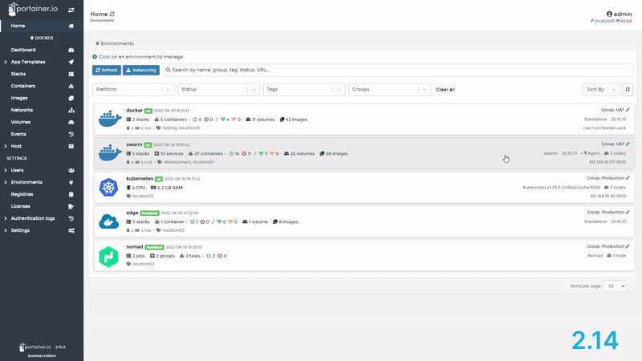
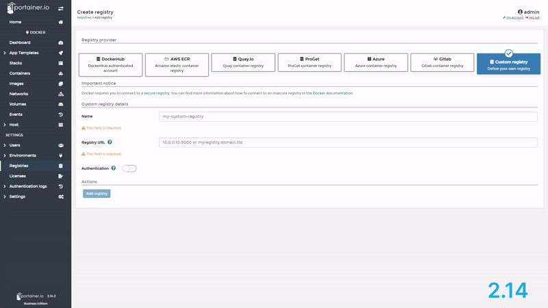
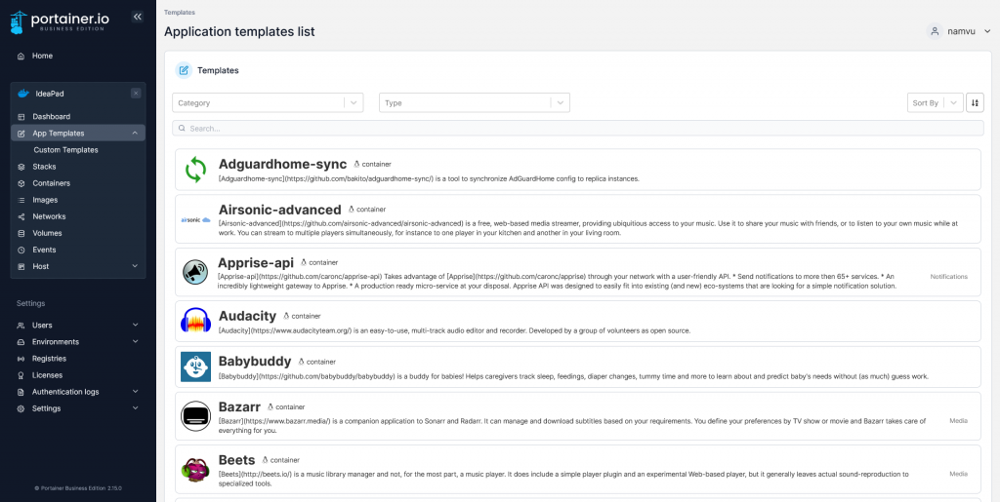

As an avid Portainer user and a UI designer, I just want to give a shout out to whoever worked on Portainer 2.15's new UI facelift. They truly did a great job. Not only does it LOOK better, it actually addresses some of the minor annoyance that existed in the old UI.

<figure>

<figcaption>

Environment Page comparison

</figcaption>

</figure>

<figure>

<figcaption>

Registry Page comparison

</figcaption>

</figure>

Now to be clear, the old UI wasn't trash or anything, it was pretty okay, but it wasn't GREAT. And while it didn't affect the way Portainer works, there were some minor visual bugs that bother UI designers and/or hardcore nitpicking perfectionists, and I just happen to be both.

Take the App Templates page for example. In the old version, there were no constraints set for the app icons, and since they come in all shapes and sizes, they often get stretched and distorted beyond recognition, making the page looking very amateurish.

That's no longer the case

<figure>

<figcaption>

Great job, Portainer UI designer

</figcaption>

</figure>
