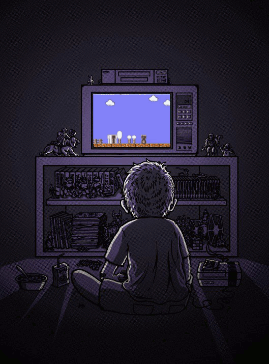

\[tatsu\_section bg\_color= "" bg\_image= "" bg\_repeat= "no-repeat" bg\_attachment= "scroll" bg\_position= "top left" bg\_size= "cover" bg\_animation= "none" padding= '{"d":"15px 0px 15px 0px"}' margin= "0px 0px 0px 0px" border= "0px 0px 0px 0px" border\_color= "" bg\_video= "0" bg\_video\_mp4\_src= "" bg\_video\_ogg\_src= "" bg\_video\_webm\_src= "" bg\_overlay= "0" overlay\_color= "" full\_screen= "0" section\_id= "" section\_class= "" section\_title= "" offset\_section= "" offset\_value= "0" full\_screen\_header\_scheme= "background--dark" hide\_in= "0" key= "fuhbjkkcgqawthfp"\]\[tatsu\_row full\_width= "0" no\_margin\_bottom= "0" equal\_height\_columns= "0" gutter= "medium" column\_spacing= "" fullscreen\_cols= "0" swap\_cols= "0" row\_id= "" row\_class= "" hide\_in= "0" layout= "1/1" key= "fuhbjkkcoleev49l"\]\[tatsu\_column bg\_color= "" bg\_image= "" bg\_repeat= "no-repeat" bg\_attachment= "scroll" bg\_position= '{"d":"top left"}' bg\_size= '{"d":"cover"}' padding= '{"d":"0px 0px 0px 0px"}' custom\_margin= "0" margin= '{"d":"0px 0px 0px 0px"}' border= '{"d":"0px 0px 0px 0px"}' border\_color= "" enable\_box\_shadow= "0" box\_shadow\_custom= "0 0 15px 0 rgba(198,202,202,0.4)" bg\_video= "0" bg\_video\_mp4\_src= "" bg\_video\_ogg\_src= "" bg\_video\_webm\_src= "" bg\_overlay= "0" overlay\_color= "" animate\_overlay= "none" link\_overlay= "" vertical\_align= "none" column\_offset= "0" offset= "0px 0px" z\_index= "0" column\_parallax= "0" animate= "0" animation\_type= "fadeIn" animation\_delay= "0" col\_id= "" column\_class= "" hide\_in= "0" layout= "1/1" key= "fuhbjkkcwniirvz"\]\[tatsu\_text max\_width= '{"d":"100"}' wrap\_alignment= "center" animate= "" animation\_type= "fadeIn" animation\_delay= "0" key= "ByKxrEF8m"\]

\[/tatsu\_text\]\[tatsu\_text max\_width= '{"d":"100"}' wrap\_alignment= "center" animate= "" animation\_type= "fadeIn" animation\_delay= "0" key= "fuhbjkkd3r50o6ib"\]

That’s what we are sometimes called, the generation of late 80s, early 90s kids (or adults, as we all should be by now). Indeed it wouldn’t be uncommon to find someone from this generation reminiscing about ‘the past’, a mere decade or two ago, as if they were centuries. But there’s a reason for that.

<!--more-->

We watched so much technological advancement come and go in such a rapid time frame when we were growing up, to the point that some becomes obsolete and forgotten in a year or two. Just within our formative years, we watched the phone going from a corded, stationary contraption to a pocket-sized mini computer. We spent our childhood outside playing outside with friends, playing tags, street soccer, jump rope, butterfly collecting, etc. Slowly we watch technology taking over everyone’s lives and now you hardly see any kids playing outside in the summer. We can clearly see the stark difference between our childhood and the current generation. We were the generation right smack in the middle of it all. Our parents were non-tech, and the next generation will be all-tech.

Not to mention, ours was the last generation that grew up with all those bright promises of “word hard, go to college, and you’ll have a successful life”, only the find those hopes abruptly dashed when the housing bubble burst, and the dotcom burst…Millennials have grown up expecting that disappointment, because for them, the problem has been there since Day 1.

So we’re that Nostalgic generation, but beyond that, we’re the BITTER generation. And our hearts ache for those days when we could still think that the world was boundless and full of magic and opportunities just waiting for us to explore and discover, just like how we were promised since the first day of kindergarten

###### \-2015

\[/tatsu\_text\]\[/tatsu\_column\]\[/tatsu\_row\]\[/tatsu\_section\]
