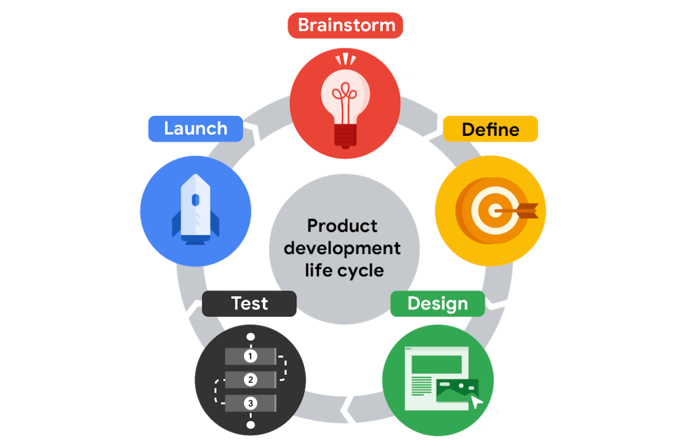
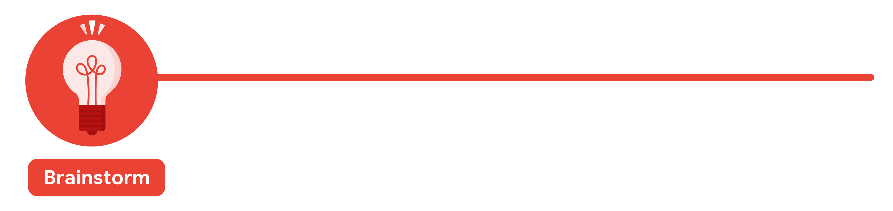
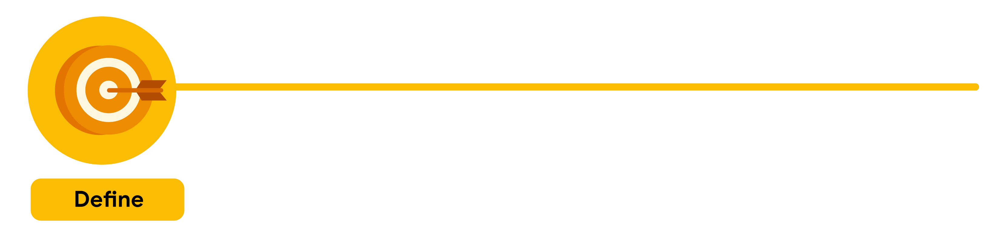
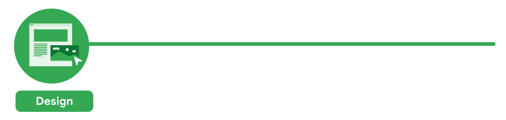
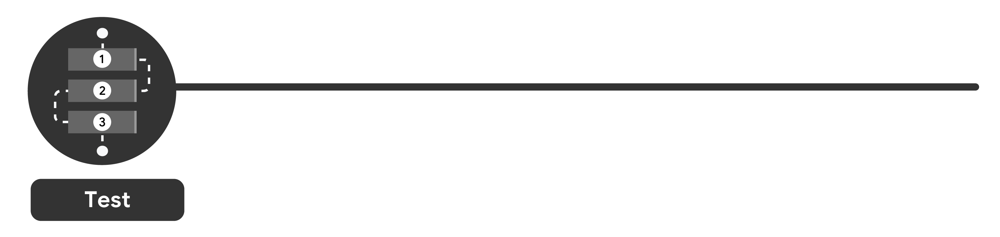
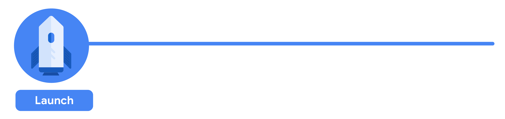

Every new product, whether it’s an app or a physical object, follows a specific set of steps that take it from the first spark of an idea to the release of the final product. This is called the **product design cycle**, and it has five stages: **brainstorm**, **define**, **design**, **test**, and **launch**. Depending on where you work, the exact names of each stage might be a little different, but the overall process is generally the same.

In this reading, you’ll explore the product design cycle and how UX design fits into each stage. As you might have guessed, UX designers are most engaged during the _design_ stage of the product design cycle, but they work closely with team members — like researchers, product managers, and engineers — throughout the entire life cycle. 

As a product moves through the development life cycle, the team might need to spend longer working in one stage than in others, or repeat certain stages based on feedback. The success of each stage depends on the previous stage’s completion, so it’s important to do them in order. 

Check out each of the five stages of the product design cycle!

<!--more-->

The first stage of the product design cycle is the **brainstorm** stage, when the team starts thinking of an idea for a product. Your team might already know the user problem that you want to solve when you begin the product design cycle. If not, coming up with a list of user problems is a great place to start.

It’s important to pay attention to the diversity of your team at this stage. Teams that have meaningful diversity across identifiers like race, gender, abilities, family structure, age, and ethnicity are generally more effective at brainstorming because they bring together a lot of different lived experiences. 

Consider this example: If you’re designing a new app to help working parents and guardians, your team might start the brainstorming stage by listing common problems that working parents and guardians face, like a lack of reliable childcare, transportation concerns, or trouble managing schedules. Your team might review user feedback about other similar products or the results of user surveys to help guide your ideas. After you’ve brainstormed lots of user problems, your team chooses one and starts coming up with ideas for solutions to that problem. 

The brainstorm stage is also an ideal time to check out your product's competitors and identify if there are already similar products available in the market. You want your product to fill a gap in the market or solve a problem better than existing products.

One more thing to keep in mind: A UX designer at a large company might not be very involved in the brainstorm stage. But a UX designer at a startup or small business could have a big role to play!

The second stage of the product design cycle brings together UX designers, UX researchers, program managers, and product leads to **define** the product. The goal is to figure out the specifications for the product by answering questions like: Who is the product for? What will the product do? And, what features need to be included for the product to be successful? 

During the define stage, your team narrows the focus of your idea. One product can’t solve every user problem. Continuing with the example for an app to help working parents and guardians, your idea should focus on helping parents and guardians find reliable childcare _or_ manage their schedules, not both. In this stage, a UX designer might help the team pin down the focus of the idea, but a product lead will probably be the one to define the scope of the project. 

Research is key during the define stage, too. You need to pinpoint your potential users’ problems, and your team can’t assume they know what problems users are experiencing without asking the users directly. User research helps determine what problems need to be addressed by the product’s design.

The third stage of the product design cycle is **design**. This is when you, as a UX designer, really get to shine! At this stage, UX designers develop the ideas for the product. Generally, UX designers start by drawing wireframes,which are outlines or sketches of the product, then move on to creating prototypes, which are early models of a product that convey its functionality.

UX writers are also involved in the design stage and might do things like write button labels or other copy within the product's wireframes and prototypes.

At this point in the life cycle, UX designers make sure to include all of the product specifications that were outlined in the define stage. You might also check to ensure that each part of the design fits together in an intuitive way. For example, UX designers might check that the screens of an app flow in a way that makes sense to the user. Or that each interaction, like tapping a button, has a correlating action, like an item getting added to a cart. On the other hand, with a physical product, UX designers might check that one piece of a physical object matches up to the connecting piece. Finally, UX designers also make sure that each task a user needs to complete is clear and easy to understand, like navigating from the homepage to the checkout confirmation page in an app.

Next, your designs move into the **test** stage. UX designers work with engineers to develop functional prototypes that match the original designs, including details and features that fit the company’s brand, like font and color choices. This also means writing the code and finalizing the overall structure of the product. 

Or, if you want to test your designs earlier, another option is to test a functioning prototype of the product, using a design tool like Figma or Adobe XD. You'll learn how to create prototypes of your designs later in the certificate program.

At this stage, the designs go through at least three phases of testing: internal tests within your company, reviews with stakeholders, and external tests with potential users. Running these tests is typically the responsibility of the UX researcher on your team, if you have one. 

- First, the team **tests the product internally** to look for technical glitches and usability problems. This is often referred to as alpha testing.
- Then, the product undergoes a **test with stakeholders** to make sure the product is aligned with the company’s vision, meets legal guidelines for accessibility, and follows government regulations for privacy, for example.
- Finally, there’s an **external test with potential users**. This is the time to figure out whether the product provides a good user experience, meaning it’s usable, equitable, enjoyable, and useful. This is often referred to as beta testing.

Gathering and implementing feedback at this stage is absolutely critical. If users are frustrated or confused by your product, UX designers make adjustments or even create new versions of the design. Then, the designs are tested again, until there’s little or no friction between the product and the user.

It’s important to call out that the product design cycle isn’t a completely linear process. Your team might cycle between designing and testing a few times before you're ready to launch the product!

Finally, you’ve arrived at the fifth and final stage of the product development cycle: the **launch** stage, when the product is released into the world! This might involve listing an app in the Google Play Store or Apple’s App Store, making a website go live, or putting a physical product on store shelves. 

The launch stage is a time to celebrate your work and start promoting the product. Marketing professionals on your team might post about the new product on social media or publish a press release. The customer support team might get ready to help new users learn how the product works. 

Program managers also meet with the cross-functional team to reflect on the entire product design cycle and ask questions like: What worked and what could be improved? Were goals achieved? Were timelines met? Making time for this reflection is super important, since it can help improve the process going forward. 

For a physical product, the launch stage might be the end of the product design cycle. But for a digital product, like an app or website, launching the product to a wider audience provides another opportunity to improve on the user experience. New users might find problems with the product’s functionality or features to improve that no one noticed before. So, after the launch stage, teams will often cycle back to the design and testing stages to start working on the next version of a digital product.

**Beyond the product design cycle** 

You now understand how products are developed and the role UX designers play in the life cycle. Everywhere you look, you’ll find products of all kinds — big, small, physical, or digital — that have been through this very process. The more you see the intention and thought put into everyday objects, the closer you’ll get to becoming a UX designer!

The product design cycle is also the core principle behind one of the most common UX Design Frameworks: the [Design Thinking Process](https://namvu.net/2021/06/common-ux-design-frameworks-design-thinking-process-and-the-five-elements-approach/).
