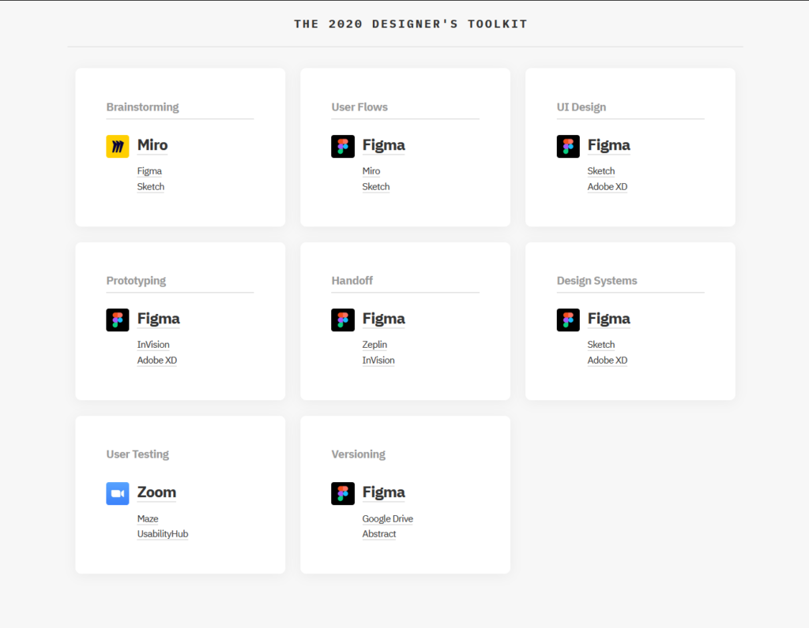

Figma is now the king in interface design industry. It didn't just overtake Sketch, it pretty much buried it six feet under. Not only that, it even managed to buried other competitors in other category too. Like prototyping (which was pioneered and led by InVision for the longest time) and handoff (something that was typically handled by Zeplin).

Figma's lead in almost every single category in the design process is a testament to what the designers truly want: more feature in a single, unified package rather than super specialized tools that focus on a single aspect of the design process.

Don't get me wrong though, specialized tools have their uses, and I'd argue their places are quite indispensable. But they are more useful in large studios with extended work pipelines where there are people dedicated to certain parts of the process.
