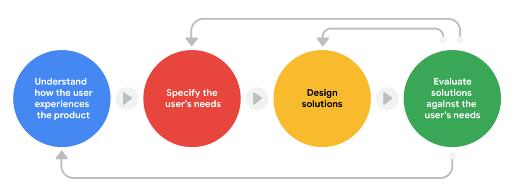

UCD is one of the term that gets thrown around alot recently, with businesses putting more emphasis on UX in their products. But just because it's used a lot, doesn't mean everybody fully understands what that is.

##### User-centered design process

Each phase of the user-centered design process focuses on users and their needs. It’s an iterative process, which means that designers go back to certain phases, again and again, to refine their designs and create the best possible product for their intended users.

At the core of the user-centered design process is a deep empathy for the user. It’s not just about what a product does for a user, it’s about how the experience of interacting with the design makes the user _feel_. 

Here are the key steps in the user-centered design process: 

- **Understand how the user experiences the product**. You want to know how users will engage with your design, as well as the environment or context in which they’ll experience the product. Understanding this requires a lot of research, like observing users in action and conducting interviews, which we’ll explore more later.
- **Specify the user’s needs**. Based on your research, figure out which user problems are the most important to solve. 
- **Design solutions**. Come up with lots of ideas for designs that can address the user problems you’ve identified. Then, start to actually design those ideas! 
- **Evaluate the solutions you designed against the user’s needs**. Ask yourself, does the design I created solve the user’s problem? To answer this question, you should test the product you designed with real people and collect feedback. 

Notice how the arrows in the diagram indicate circular movement. This illustrates the iterative quality of the user-centered design process. Designers go back to earlier phases of the process to refine and make corrections to their designs. With the user-centered design process, you’re always working to improve the user’s experience and address the problems that users are facing!

<!--more-->

##### Guiding principles for the user-centered design process

1. **Design for users and their needs.** It can be tempting to design something in a certain way because it looks cool or solves one of your own problems, but it’s essential to keep in mind that you are _not_ the end user. You're designing to help a diverse set of humans with specific needs. 
2. **Make your copy conversational.** The writing within your product design should have a friendly, simple, and easily accessible tone. Avoid jargon or overly-complicated terminology that users might not understand.
3. **Present all information clearly.** Users should be able to navigate your product design easily and without assistance from others. Make key information, like checkout buttons, simple to find and identify. 
4. **Acknowledge user actions.** Your product should let users know when they’ve executed a task correctly. That might be as simple as having a new window pop up when an icon is pressed, or as complex as animated tossed confetti to demonstrate that the user has accomplished a task. 
5. **Offer support.** As UX designers, our goal is to make designs accessible and understandable to every user, but sometimes we fall a bit short. Offer users a safety net, like a support center or list of Frequently Asked Questions. Make sure a frustrated user doesn’t have to swipe and click all over the product to find help. 

It’s also important to have empathy for yourself and your design team throughout the user-centered design process. When you’re trying to improve the user experience, you’ll inevitably fail at some point. That’s okay! It’s disappointing when a design fails, but there’s no reason to feel defeated. Learning from that experience will give you the tools and the understanding to try again.

**TL;DR:** UCD is, in essence, a core UX design framework that [other UX design frameworks](https://namvu.net/2021/06/common-ux-design-frameworks-design-thinking-process-and-the-five-elements-approach/) are based on.
